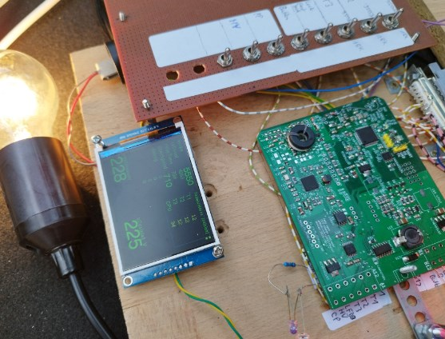
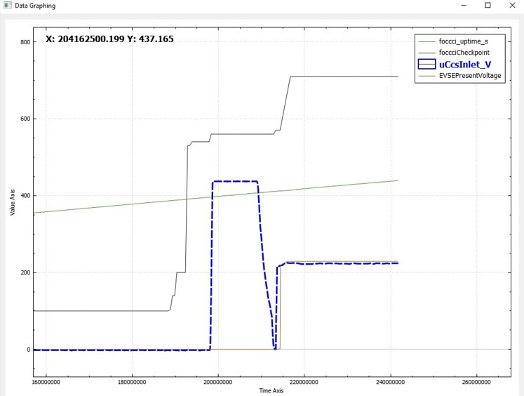
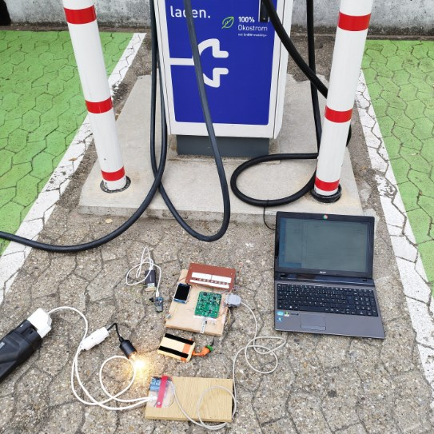
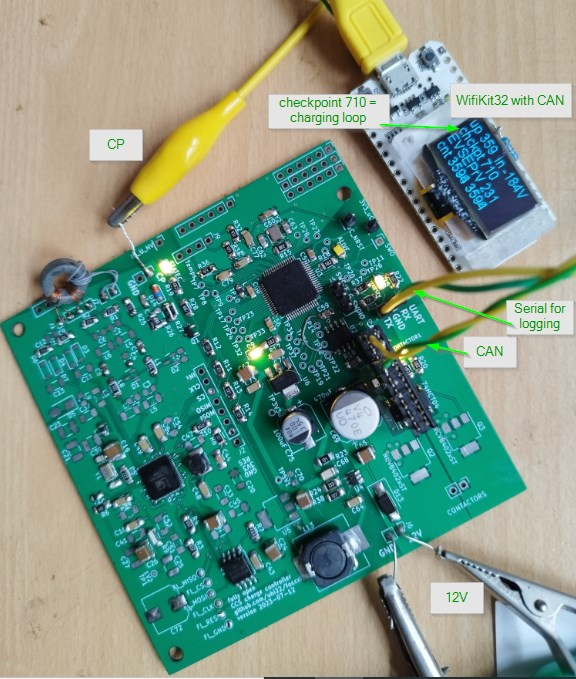
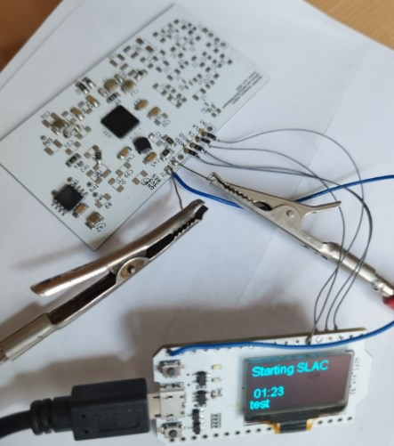
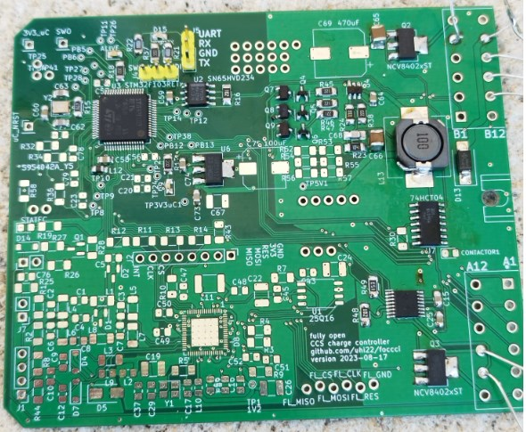
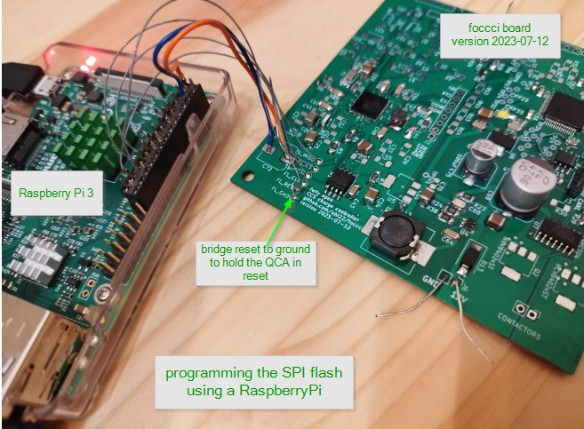
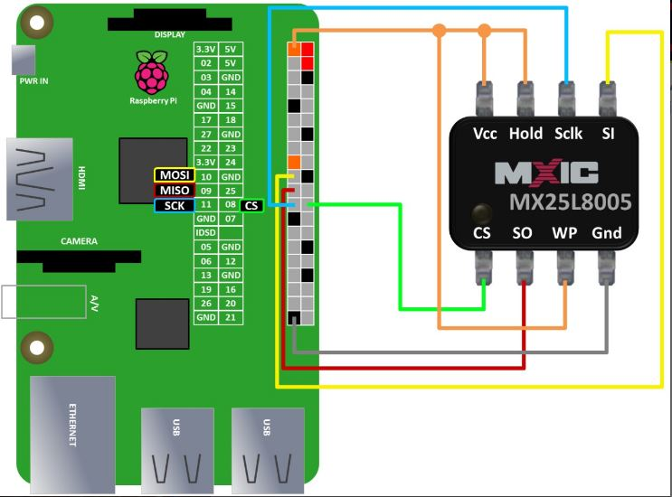

# foccci - The Fully Open CCS Charge Controller Interface

Charge Controller that enables CCS charging of homebrew electric vehicles.
Driven by the OpenInverter forum community, https://openinverter.org/forum/
Based on the QCA7005 PLC modem and an STM32 microcontroller.

# News

## 2023-12-13 Supercharging works. Halve a dozen boards are spread around the world. 

Johu is charging the Touran on the TESLA Supercharger using the hand-populated V3 board: https://openinverter.org/forum/viewtopic.php?p=64563#p64563 and https://www.youtube.com/watch?v=OKg3VUslol8
The first JLC populated boards have been completed manually, only one bug in the schematic needed a small workaround. Boards are on the way to several enthusiasts for further testing. The software is growing thanks to the great openinverter community.

## 2023-10-25 First Order of Populated Boards

Received four reservations on openinverter forum, and this was the trigger to create version v4.1 with minor layout
improvements, and to order a batch of five
at JLCPCB. Total cost for five: $127.32 including shipping, taxes and duties. The NCV8402 was out of stock,
and the QCA7005 is anyway not in their stock. So the material price is

- 25€ JLCPCB populated PCB
- 12€ QCA7005
- 4€ 2 x NCV8402
- 1€ RF transformator
- <1€ connectors for programming and serial line

## 2023-10-08 Light-Bulb-Demo-Charging on Alpitronic and ABB works

Using the foccci V3 board together with ccs32clara software, the muehlpower voltage sense board, a cheap chinese relay, the light-bulb-demo
worked on the first attempt on alpitronics hypercharger and on an ABB triple charger.

## 2023-07-28 Charging Loop Reached

The foccci board version 2023-07-12 runs the STM32F103 and the QCA7005, and successfully enters
the charging loop, with simulated evse by pyPLC. It provides the checkpoint number and some other
informations via CAN with 500kBaud. On the other side of the CAN sits an ESP32 Wifi-Kit-32, with
a CAN transceiver added. It shows the data of the CAN on its OLED display.

## 2023-07-09 The board starts talking

After the PCBs and QCAs arrived, the soldering was the next challenge. It went well, and the board started talking to
the ESP32 running ccs32berta https://github.com/uhi22/ccs32berta

https://openinverter.org/forum/viewtopic.php?p=58627#p58627

## 2023-06-21 First PCB with the QCA7005

...is ready in KiCad and is sent to JLCPCB. It is a two-layer, and has so many capacitors, that they do not really fit
to the place where they would make sense. Caused by taking the schematic from the Millisman design, but changing
the size to 1206 for easy hand soldering. Btw: Below five dollars for five PCBs, including shipping, duties and taxes.

## 2023-06-14 The Idea Is Born

...and the discussion is starting on the OpenInverter forum
https://openinverter.org/forum/viewtopic.php?p=57643#p57643

# Board versions

## V1 June 2023

- Just the QCA7005, exposing the SPI interface.
- No controller, no voltage regulator, no CP logic.
- Test result summary: Light-bulb-demo-charging works on alpitronics, with ccs32berta running on ESP32. (https://github.com/uhi22/ccs32berta)

## V2 2023-07-12

- STM32 controller
- Power supply
- CAN transceiver
- CP logic
- Two contactor drivers
- Test result summary: Light-bulb-demo-charging works on alpitronics, with ccs32clara https://github.com/uhi22/ccs32clara running on the STM32.  https://openinverter.org/forum/viewtopic.php?p=59821#p59821

## V3 2023-08-17

- HBridge driver DRV8874 for connector lock
- discrete drivers for RGB LEDs
- Deutsch Connector 2x12pins
- added CP and PP sensing
- changed from 2 layers to 4 layers
- Test result summary: The new output drivers work with https://github.com/uhi22/ccs32clara. Other tests still in progress.
- Issues:
    - Diode to 3V3 is missing in the CP sense path (R58). Need to be patched.
    - There is a via near the pin1-corner of the QCA, which is very near to the metal frame at the corner, and may cause shortcut between 1V2 and ground.

## V4 2023-09-10

- Prepared for assembling by JLCPCB
- No 1206 size components anymore. Means: 0805 is the new default size now.
- Test result summary: PCBs not ordered yet. No testing done yet.
- Outdated, never produced.

## V4.1 2023-10-25

- functionally identical to V4
- moved via away from QCA corner to avoid solder bridge
- silk screen improvements: more component names and better readability
- Test result summary: one issue found (shortcut on the RX inputs to ground via inductors). After fixing this, everything works fine.

## V5 work in progress

- main goal: sleep-wakeup-logic

# Background

The QCA7005 schematic and board was originally designed by Millisman https://github.com/Millisman/QCA7000, then forked to https://github.com/uhi22/QCA7000board and then renamed to https://github.com/uhi22/foccci

# Changes to the original Millisman design

## Schematic
- removed JTAG completely
- removed connector for SPI flash, added testpoints instead

- ATP_P and ATP_N are reserved analog test points. Leave unconnected without testpoints.
- ZC_IN connected to ground. Not used.
- PLL_BYPASS has an internal pulldown. Removed the external pulldown.
- Removed the LEDs on the GPIO.
- RSVD06 and 07 are "do not connect". Removed the test points.
- Bugfix: The ground was missing between C13 and C14.

## symbol QCA7000:
 - RSVD01 changed to power_in, because connected to 3.3V
 - RSVD04 changed to power_in, because connected to 1.2V
 - TCK changed from output to input, because this is the test clock driven by debugger. Even if the data sheet says "output".
 
## Footprints in Schematic

- changed the 100nF to 1206 for easy handsoldering (and back to 0805 for some, to safe space)
- changed the 10µF to 1210
- changed other 0603 Cs to 0805
- changed L and Rs to 1206 (and the beads back to 0805)

## Todos for now

- [x] For C69, how to workaround the forced switch from "economy" to "standard" service? Workaround: use C3445244, discussed here: https://openinverter.org/forum/viewtopic.php?p=65016#p65016
- [x] Remove DC-grounding of the RX inputs. Done: C32 and C33 added on the RX inputs.
- [x] Transformer (discussion here: https://openinverter.org/forum/viewtopic.php?p=64465#p64465) see https://jlcpcb.com/partdetail/3170710-CL4532A201/C2904734 Done: Added into new lib transformerCL4532A-201 and to schematic and pcb.
- [x] Adapt the part number for the NCV8402 (discussed here: https://openinverter.org/forum/viewtopic.php?p=62903#p62903). Done: Part number C77755 instead of C236053
- [x] Adapt the footprints / part numbers for the parts which JLC could not populate
    - [x] U1 Flash: Old: Package_SO:SOP-8_5.28x5.23mm_P1.27mm, must be SOIC 150mil (order code SN), which is Package_SO:SOIC-8_3.9x4.9mm_P1.27mm.
    - [x] L11: The https://jlcpcb.com/partdetail/C162588 is normal 1206. Changed from Inductor_SMD:L_1812_4532Metric_Pad1.30x3.40mm_HandSolder to Inductor_SMD:L_1206_3216Metric_Pad1.22x1.90mm_HandSolder
- [x] Add additional mounting holes
- [x] Stepdown layout optimization (discussed here: https://openinverter.org/forum/viewtopic.php?p=61697#p61697), including smaller L, e.g. https://jlcpcb.com/partdetail/LantuMicro-SMS1050100MT/C5127462 instead of C3000379. And, next step, even smaller
https://jlcpcb.com/partdetail/Sunlord-MWSA0503S100MT/C408412 is 5.1 x 5.4mm.
- [x] TVS at the 12V. SMAJ18A
- [ ] TVS at the CP    
- [ ] add optional "Molex Mini-Fit Jr. Header, Dual Row" for the case, that the Deutsch is not needed in certain use cases.
- [ ] Docu: add details of step-by-step bring-up, incl current consumption, and typical errors
- [ ] more copper cooling area for the NCVs
- [ ] analog current feedback from the DRV8874 IPROPI to the controller
- [ ] more temperature inputs (6, to support L1, L2, L3, N, DC+ and DC-)

## Todos for Later

- [ ] The use of the LEDs on GPIO0 to 3 is not clear. Are they used in the automotive firmware at all? GPIO3: on the CCM, this is connected to µC.43 via R8 (0 ohms). Measure the pin.
- [ ] Regarding AMS1117-3.3 for the 3v3 regulators. These are tried and tested, but you may wish to avoid the polarized capacitor by using a more modern regulator. Consider TLV75733PDBV "Stable With a 1-μF Ceramic Output Capacitor"
- [ ] The STM32F103 seems to meet the requirements and it's popular but be aware that it has a basic ARM core with no FPU. And: Do we need a low-power variant (stm32L4 series)?
- [ ] Low-power concept is missing. Is the unit permanently powered? Do we need sleep/wakeup via inputs and/or CAN?
- [ ] The QCA7005 is labelled QCA7000.
- [ ] missing the JTAG port pull down resistors on the QCA
- [ ] Could do with one more processor decoupler so that a cap can be dropped right against every package power pin.
- [ ] Would be worth adding lines to the QCA7005 Reset (so that is can be reset without a power cycle) and the Int pins (just in case it's needed in the future).
- [ ] Might put a Schottky protection diode on the temperate sense inputs.
- [ ] Clarify interface (electrically and mechanically)
    - [ ] Electrically: Interface ideas here: https://openinverter.org/forum/viewtopic.php?p=58697#p58697
- [ ] supply voltage measurement (to be able to adjust the PWM for contactors according to the supply voltage, and just for info)

## Finished Todos
- [x] move as much as possible bottom layer components to upper layer, to allow population by JLBPCB
- [x] adapt layout for changed footprints
- [x] check/remove/correct the JLCPCB part numbers for all parts. Most parts now 0805.
- [x] add protection diode for CP sense
- [x] CP sensing
- [x] 5V on the connector for supply of the muehlpower high voltage sense board
- [x] Clarify expected contactor current and use appropriate drivers
- [x] Footprints for the bigger capacitors too small. -> Use 1210 for C65, C66, C67, 
- [x] Many texts in the silk screen are not readable due to overlap with solder or components
- [x] Some of the many capacitors on the supply lines could be removed
- [x] Use 0805 for all 100nF, instead of mixing 0805 and 1206.
- [x] The EN pin of the CAN transceiver should have the flexibility to solder-bridge to GND and 3V3, to allow different type of transceivers.
- [x] Change footprint of the test points for flash programming, so that squared connector pins fit into.
- [x] highside LED drivers for RGB button
- [x] VDDA of the STM32 needs additional 1µF according to STM application note AN2834. https://www.st.com/resource/en/application_note/an2834-how-to-get-the-best-adc-accuracy-in-stm32-microcontrollers-stmicroelectronics.pdf chapter 4.2.1 -> C14 added.
- [x] add port locking driver
- [x] Complete the schematic and the layout for the DRV8874 h-bridge driver
- [x] add PP detection
- [x] change to 4 layers
- [x] One of your AMS1117 seems to have a 100nF output cap and the other doesn't.
- [x] 470u input cap is an electrolytic? Yes.
- [x] Which connector? DTM13-12PA-12PB-R008 https://openinverter.org/forum/viewtopic.php?p=58697#p58697
- [x] HCT04: Risk of activating the contactors if the controller power fails. Find a better solution.
- [x] Check boot config on GPIO 0 to 2.
    - [x] GPIO0: High during boot to boot from the SPI Flash. (pin60) CCM: R9 is 3k3 to 3V3.
    - [x] GPIO1: must be pulled low during reset. (pin61) CCM: R11 is 3k3 to ground.
    - [x] GPIO2: 0=legacy SPI, 1=burst SPI. Which is used in the CCM? (pin62) CCM: R10 is 3k3 to 3V3, and the not-populated R27 into direction of µC.
        - [x] connect the GPIO2 with pullup to 3V3
- [x] add LEDs for functional check
- [x] add mounting holes
- [x] correct voltage divider in the TPS54302
- [x] 3V3_uC and NRST on connectors for debugger
- [x] removed the wrong part number and datasheet for the 8MHz XTAL
- [x] larger footprint for L10: From 1206 to 1812
- [x] check all pins -> all plausible with the data sheet.
- [x] check the QCA footprint -> fits.
- [x] assign footprint to all components in the schematic
- [x] add CP logic
- [x] add microcontroller
- [x] add power supply
- [x] add contactor driver outputs
- [x] add port temperature sensor inputs
- [x] Takeover from CCM:
   - [x] RBIAS (pin 51, R9). In the CCM this is R19 with 2,5k. Used 3k || 15k, this is exactly 2k5.
   - [x] BIAS_REF (pin 40, R6). In the CCM this is R23 with 6,2k. -> Changed from 2k5 to 6k2 in the schematic. Populated 6k8.
- [x] What's going on with the missing processor Gnd pins, are they mapped within the part? Yes, in the layout they are correct.
- [x] Add LIM-like current input for HVDC voltage measuring, https://openinverter.org/forum/viewtopic.php?p=58839#p58839

# Interface
(This is just a draft. Work in progress. This is NOT matching the interface of the current draft board.)
1. Supply 12V (not decided whether switched or permanent)
2. Supply Ground. Also wired to PE of the CCS inlet.
3. CANH
4. CANL
5. CP (CCS inlet)
6. PP (CCS inlet)
7. Contactor1 (low-side switch 2A permanent, 5A peak)
8. Contactor2 (low-side switch 2A permanent, 5A peak)
7. Sensor ground (for temperature sensors and analog inputs)
8. Temperature1 (CCS inlet) NTC or PT1000
9. Temperature2 (CCS inlet) NTC or PT1000
10. Temperature3 (CCS inlet) NTC or PT1000
11. Analog_in1, connector lock feedback. Internal pull-up, external resistor to ground.
12. Digital_in1, charge stop button. Internal pull-up, external switch to ground.
13. HVDC_in (current input for HV DC voltage measurement, LIM compatible)
14. LED_RED (Charge port/button colored illumination) 12V highside output
15. LED_GREEN (Charge port/button colored illumination) 12V highside output
16. LED_BLUE (Charge port/button colored illumination) 12V highside output
17. Connector Lock Motor 1 (12V=lock)
18. Connector Lock Motor 2 (12V=unlock)

Optional / to discuss
19. Input for fuel flap feedback switch
20. Output for fuel flap opening actuator
21. Input for HV contactor feedback
22. Charge port illumination (RGB WS2812?)
23. GPIO spare (12V capable input and low-side output driver)
24. Analog input spare (0 to 20V capable input)

# Connector and Housing

Ideas: https://openinverter.org/forum/viewtopic.php?p=59972#p59972

Plan:
- use the DTM13-12PA-12PB-R008 - 2 x 12 pins
- data sheet: https://www.te.com/usa-en/product-DTM1312PA12PBR008.html (mentioned here: https://openinverter.org/forum/viewtopic.php?p=60064#p60064)
- Enclosure: https://www.te.com/usa-en/product-EEC-325X4B.html

# Power supply options

## The OpenInverter VCU supply
From openinverter VCU (https://github.com/jsphuebner/stm32-vcu/blob/master/Hardware/GS450H_VCU_V3%20-%20Schematic.pdf)
- MP2359DJ as step down from (6V to 24V) to 5V.
    - datasheet https://www.monolithicpower.com/en/documentview/productdocument/index/version/2/document_type/Datasheet/lang/en/sku/MP2359/document_id/228
    - cheap (5 parts 6 euros on ebay from China)
    - "not recommended for new designs"
    - 1.2MHz fix frequency
    - output 1.2A
- Inductance 4.7µH
    - https://www.ebay.de/itm/334756668131?hash=item4df10d62e3:g:Hu4AAOSwRCRj86ed&amdata=enc%3AAQAIAAAAwIlevbuviFR%2B0sjLqsPehVa9Mno3sqzzhAv3LPRo3KcUvaykIYunXIY%2F6kRUSaiXK5sxV1t7o6ReDxByHBYLAhPif7xMisKOHJRe1dCUs9QruNQxlB6LcW5UJkvSTVXsbasBOmmE3yyvdi3%2BJhKULt%2FBdUvi7mYam5gGjXVT8NatmV1PEGNg2LraRAexKYMFv26DKrSs18nwkORQiPaLSAPr%2FQbpYCTiZrpDff3C6W%2FKVuP7u9js2OE2MjbdKU8vHQ%3D%3D%7Ctkp%3ABk9SR7q575ylYg

- Diodes for reverse polarity and step down: Schottky SS54B-HF, 40V, 5A.
    - https://www.mouser.de/datasheet/2/80/20190806170503-2505092.pdf
    
- ams1117-3.3V linear from 5V to 3.3V
    - output 1A
    - cheap (10 parts 4 euros on ebay)
    - datasheet https://datasheet.lcsc.com/szlcsc/2001081204_Shikues-AMS1117-1-2_C475600.pdf
Conclusion: Seems ok for feeding the QCA7005 and ESP32 plus other small consumers.

## The zombieverter supply
From https://github.com/jsphuebner/stm32-vcu/blob/master/Hardware/Zombie/ZombieVerter_V1%20-%20Schematic.pdf
- XL1509-5.0 as step down from (6V to 40V) to 5V
    - https://datasheet.lcsc.com/lcsc/1809050422_XLSEMI-XL1509-5-0E1_C61063.pdf
    - 2A constant output
    - 150kHz fix frequency
    - recommended L: 68uH/2A
    - cheap (10 parts 9 euro on ebay from China)
- Inductance 68uH:
    - e.g. SMD 12x12x7mm
    - e.g. https://de.aliexpress.com/item/4000079812764.html?spm=a2g0o.detail.0.0.1db9fSpGfSpGmG&gps-id=pcDetailTopMoreOtherSeller&scm=1007.40050.281175.0&scm_id=1007.40050.281175.0&scm-url=1007.40050.281175.0&pvid=03c46a0a-7aed-47f8-b4c4-6e97bc2d985f&_t=gps-id:pcDetailTopMoreOtherSeller,scm-url:1007.40050.281175.0,pvid:03c46a0a-7aed-47f8-b4c4-6e97bc2d985f,tpp_buckets:668%232846%238114%231999&isseo=y&pdp_npi=3%40dis%21EUR%211.84%211.84%21%21%21%21%21%40211b613116886252208597357e08be%2110000000209047381%21rec%21DE%21
    

## The Catphish supply
From https://openinverter.org/forum/viewtopic.php?p=58555#p58555
- TPS54302 as step down from (6V to 28V) to 5V
    - voltage is flexible by resistor divider
    - output 3A
    - 400kHz fix frequency
    - SOT-23 (6) package
    - no external diode on the output required
    - https://www.ti.com/lit/gpn/tps54302 
- L 10uH, JLC C408412
- TLV75733PDBV linear from 5V to 3V3
    - 1A
    - SOT-23 5pin
    - https://www.ti.com/lit/ds/symlink/tlv757p.pdf?HQS=dis-mous-null-mousermode-dsf-pf-null-wwe&ts=1688651505013&ref_url=https%253A%252F%252Fwww.mouser.co.uk%252F

## Plan
- Reverse-polarity diode:  SS54B-HF, 40V, 5A.

# CAN Transceiver
- SN65HVD234
    - https://www.ti.com/lit/ds/symlink/sn65hvd230.pdf?HQS=dis-dk-null-digikeymode-dsf-pf-null-wwe&ts=1688711367456&ref_url=https%253A%252F%252Fwww.ti.com%252Fgeneral%252Fdocs%252Fsuppproductinfo.tsp%253FdistId%253D10%2526gotoUrl%253Dhttps%253A%252F%252Fwww.ti.com%252Flit%252Fgpn%252Fsn65hvd230

# Requirements
- [ ] 8V to 30V power supply
- [ ] PLC communication
- [ ] CAN communication
- [ ] CP level handling (and -detection?)
- [ ] PP detection
- [ ] 12V highside LED drivers (for RGB LEDs as in BMW LIM)
- [ ] Contactor driver (with PWM?) for two contactors
- [ ] Charge port temperature sensing (2 channels, either NTC or PT1000)
- [ ] Connector lock motor bridge and connector lock feedback
- Optional:
    - [ ] Analog input for HV voltage sensor at the charging port
    - [ ] fuel flap switch
    - [ ] button to start/stop the charging process
    - [ ] HV contactor feedback
    
# Requirements for the low-power-mode

- The foccci shall fall in low-power-mode, if not needed. The consumption shall be less than 5mA during this mode.
- The foccci shall use the enable pin of the step down converter TPS54302 to shut down the power supply.
- The following ways shall be used to activate the high-power-mode:
    - CP line: A significant voltage (above 4V) for a significant time (at least some milliseconds).
    - Button: A button to ground, internally pulled-up to 12V, if pressed long enough (at least some milliseconds).
    - microcontroller: The STM32 shall be able to keep itself powered by using a toggle pin. In case of stuck to high or low, the foccci shall power-down.
    - Not planned at the moment: Wakeup via CAN communication. This would be a helpful use case, if the user wakes the car via remote key (unlock), and the connector is unlocked by this activity.
    

# Controller

STM32 selection:

Overview: http://stefanfrings.de/stm32/stm32f1.html

https://www.st.com/en/microcontrollers-microprocessors/stm32f103.html
- STM32F103C8T6 ("blue pill") 64kB Flash and 20kB RAM too small. -> FAIL
- STM32F401CC ("black pill") 256kB Flash and 64k RAM. No CAN -> FAIL
    - https://www.st.com/en/microcontrollers-microprocessors/stm32f401cc.html
- STM32F103RC 256k Flash, 48k RAM, CAN 
- STM32F103RD 384k Flash, 64k RAM, CAN (10 pieces 22 euro on Aliexpress)
- STM32F103RE 512k Flash, 64k RAM, CAN (10 pieces 24 euro on Aliexpress)
- STM32F303RE (Nucleo demo board available) (STM32F303RET6) 512K Flash, 80k RAM, LQFP-64, 1 CAN. (6 euro on Aliexpress)

Programming:
- en.st-stm32cubeide_1.12.1_16088_20230420_1057_x86_64.exe

# First run of the June 2023 version

- Starting with power suppy connected to the 3V3, but set to 0V. Slowly increase the voltage to 0.5V. Observe the current. No current is good.
- Measure, whether the DVDD pins of the QCA and 3 pins of the Flash have 0.5V.
- Connect multimeter to 1V2, and turn the power supply slowly up.
- With 2V, the board draws 4.5mA.
- At 2.7V, the current jumps from 6mA to 13mA. This is when the 1.2V regulator starts delivering its intended output voltage.
- At 3.3V, the current is 20mA. This does not look like normal operating current.
- On the L10 input, there is a 0V/3.3V quare wave with 600ns cycle time. This looks normal for the step-down-converter.
- On the R6 (both sides), there is the 25MHz clock, with ~1V amplitude.
- The Reset line is 3.3V (no reset). When pulling it to ground, the current consumption increases from 20.8mA to 23mA.
- The CS of the Flash is permanent high. This means, the QCA does not want to load its programm code from the Flash. Something is wrong.
- The RBIAS and R_BIASREF were not populated. Added them.
- Looks better: At 3V3, the current is 80mA. At the CS of the Flash there is activity for one second after power-on. Seems the QCA is fetching its program code.
- Connect the ESP32 with the ccs32berta via SPI, using 220 ohm protection resistors in all four SPI lines. ESP powered via USB, QCA powered from 3.3V bench power supply. Result: The Berta finds the modem and starts the SLAC.

# Programming the SPI Flash

An introduction how to use a Raspberry to program the SPI flash is here:
https://www.rototron.info/recover-bricked-bios-using-flashrom-on-a-raspberry-pi/
The connection is quite simple: SPI_FLASH_programming_with_Raspberry.jpg

Make sure that SPI is enabled in the settings of the Raspberry.
Install the flashrom tool: `sudo apt-get install flashrom`
The docu of flashrom is here: https://www.flashrom.org/Flashrom

Check whether the device is detected: `flashrom -p linux_spi:dev=/dev/spidev0.0,spispeed=2000 -V`

Binary is available here: https://github.com/uhi22/Ioniq28Investigations/blob/main/CCM_ChargeControlModule_PLC_CCS/CCM_FlashDump_SpiFlash_2MB_Ioniq_00_33_79.bin

For viewing the binary, a hex editor can be used, e.g. http://www.funduc.com/fshexedit.htm

To flash the binary file to the SPI flash: `flashrom -p linux_spi:dev=/dev/spidev0.0,spispeed=2000 -w myfile.bin` In the case that to tool complains that multiple flash chip definitions match the detected chip, choose the correct one with the option `-c "MX25L...something...`

# Create Fabrication Output for JLCPCB

Starting with KiCad7, the The xsltproc appears to have been removed. So the procedure to create the BOM needs to be adjusted.
In https://gist.github.com/arturo182/a8c4a4b96907cfccf616a1edb59d0389 we find, that there is a plugin now: "Fabrication Toolkit".
This can be installed with the "Plugin and Content Manager" in the KiCad main window.
Then, in the PCB editor, use the FabricationToolkit from the toolbar. This creates a new folder in <project>/production/, which
contains a zip with Gerber and drill files, and also the BOM, positions and designator files.

The docu of the Fabrication Toolkit is here: https://github.com/bennymeg/JLC-Plugin-for-KiCad

Some of the IC footprints have the wrong orientation in the JLCPCB viewer. The Fabrication toolkit offers the possibility to
rotate (and shift, if necessary) the footprints, by adding in the schematic an attribute 'JLCPCB Rotation Offset'.
Thanks to jrbe for the hint in https://openinverter.org/forum/viewtopic.php?p=61049#p61049

# JLCPCB offers

Offer 2023-08-27: 5 PCBs, 2 populated.
- Option A: All available components: $82, which includes Extended components fee: $45.30
- Option B: Only basic components. $21. Plus shipping and duties, = $38.

Offer 2023-08-28: 5 PCBs, 5 populated.
- Total $107 for 5 populated PCBs, plus shipping ($13) and duties and taxes ($23). Plus QCA, connector, inductor, transformator, housing.
- Includes $42 extended components fee.

# Soldering Lessons

[solder_lessons.md](doc/solder_lessons.md)