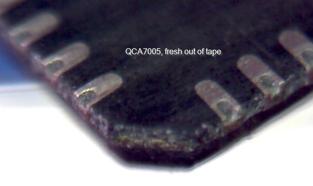
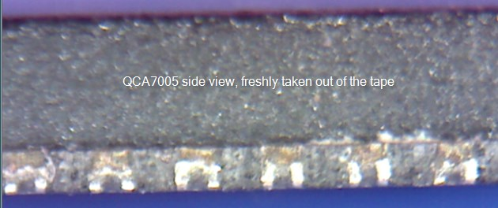
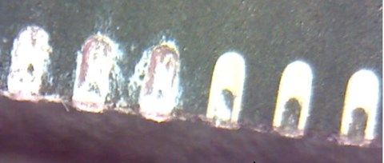
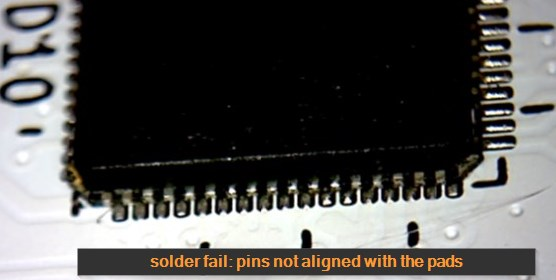
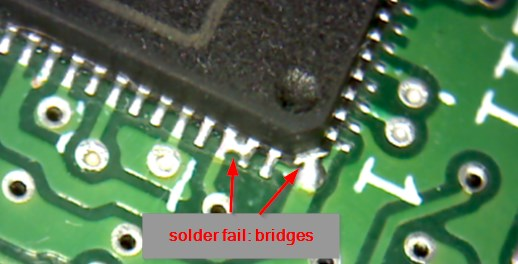
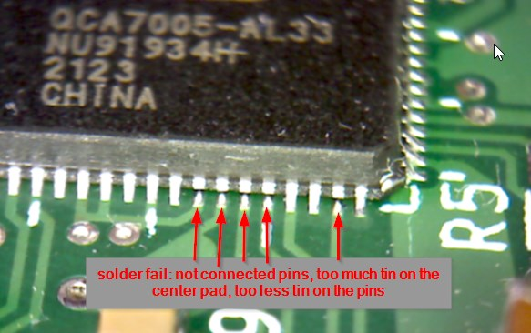
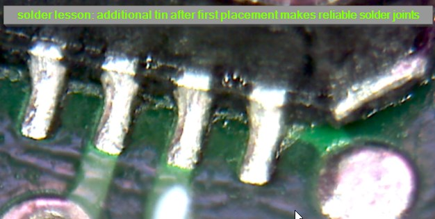

# Solder lessons

This is an (incomplete) collection of lessions regarding soldering the QFN package.

## Hand soldering QFN?

Yes, this works. What do we need?

- Solder tin, standard, Sn60PbCu2
- Solder iron, fine tip and thick tip
- Solder flux (e.g. KELLY SHUN KE-500, from https://de.aliexpress.com/item/1005004009158994.html?spm=a2g0o.productlist.main.69.21a767c6hAeVsj&algo_pvid=252c5188-29b8-43b4-b004-114b31abcb12&aem_p4p_detail=2023093010324612971486099152500005822926&algo_exp_id=252c5188-29b8-43b4-b004-114b31abcb12-34&pdp_npi=4%40dis%21EUR%2117.17%2112.88%21%21%2117.74%21%21%4021038edc16960951664777338eb1ed%2112000027727115734%21sea%21DE%211703240420%21&curPageLogUid=KGEtOY1yyVfp&search_p4p_id=2023093010324612971486099152500005822926_7 )
- Hot air station, e.g. AOYUE Int 852, e.g. from https://www.ebay.de/itm/163304333026?hash=item2605b25ee2:g:WqwAAOSwpwZbvFV3&amdata=enc%3AAQAIAAAAwFlzeDrJO7b8HhJdZ3vwTSyqoQYJexOlnPV28sXuqqNSMLRpoaUNjsGuVeVEaJ0IP7PCrxhW%2BHqaBwM3KBOLPfd8R7fyxyabGZUfb%2BLq8ifpXTjBrB8YrZpmgegGgEBr4ewlGoiHqpLufG9SLcWsM1Rh6tDph8lg%2BrgFPVSnXZaZ2Kb%2FitKgHWyy6avdUU2YXV1bVeSsLtXNJxzy4CHZ33TafjwNiaPju79kKm9t9u5ca4x7UAIzbtqxwySOQioNWw%3D%3D%7Ctkp%3ABk9SR8a60fLcYg

- A kitchen stove with ceramic hob, or something similar
- An infrared thermometer
- A magnifying glass, for example 4 diopters
- In best case a cheap (USB) microscope, e.g. https://www.ebay.de/itm/295649324815?hash=item44d612af0f:g:3UUAAOSwhTJkQ5sc&amdata=enc%3AAQAIAAAA4LznO4r7zim6RK%2B5baS72xS6C%2F3kDfzFzlNEA%2FGCGgK1HgmkIp8%2Bq82Imf%2Fdyopb9fjKfYx2PGrVR5xDISRsS1Xo6P3VCWCBbKzd1Zm%2FHXuldaHFAjJGZPeL%2Bbr6zTGexRYbnSPf7dYHsgUSi51XRfDNBpF%2FnVvvlABTOXbTGMXqZ2009oec5kLwJZyn18SFXVu34wVY%2BCIE4dky9L8BC30iovPhiRf9vB%2FKAKpvqBBKY%2B3jJshJcPxxNIW636ofmfpGTDvyFPVW1JxdEWhVo8shWjHiXwKfAaHBWfKbfqJf%7Ctkp%3ABk9SR_Lw6vLcYg
- Isopropanol and a small, hard brush for cleaning
- Solder wick

## Tested workflow

Still untinned:

1. Pre-tin the pins of the QFN package. They may have some oxidation, so you need an amount of flux, a hot iron and patience. Do not hurry, make sure that each pin has got tin, on the underside and also on the edge.
2. Pre-tin the center pad, and remove the tin on the center pad using solder wick.
3. Clean the package with isopropanol and brush.
4. Inspect the QFN carefully. All pins should have a certain amount of tin, with a smooth surface and no holes. If this is not yet reached, go back to step 1. The temperature of the iron should be hot, to have an effective reaction of the flux, but not as hot that the flux turns its color to brown or black.

Tinned (left side) and untinned (right side) pins

5. Pre-tin the PCB. Use flux and a big drop of tin, and walk over the pads. Since the pads are a "level below" the surface of the solder mask, it may happen, that the tin does not reach the pad. Make sure to reach each pad, but using a pointed iron and move its tip on each pad.
6. Pre-tin the center pad on the PCB. For this you need a thicker iron, because the heat will flow away through the copper layers.
7. Remove the tin on the center pad using solder wick.
8. Clean the PCB with isopropanol and brush 
9. Inspect the PCB. Each pad should have the same amount of tin. The center pad should be completely flat. If any anomalies are present, go back to step 5.
10. Put a _small_ single drop of tin to the center pad on the PCB. The less the better. Too much tin on the center pad will produce contact problems on the pins, because the QFN will float on the center. Too less tin on the center pad contains the risk of no contact of the center pad.
11. Add fresh flux on the PCB.
12. Place the QFN on the PCB. The exact placement does not matter yet. Make sure the orientation is correct.
13. Put the PCB on the stove. Shortly turn on the stove, and observe the PCB temperature with the infrared thermometer. Goal is 100°C to 120°C. If there is smoke, then it is definitely too hot. Remove the PCB, let everything cool down. It is fine that this pre-heating takes 2 or 5 minutes.
14. Observe that the flux becomes liquid and the QFN floats in it.
15. Use the hot air to further increase the temperature. The flux is gasing, the QFN may jump a little bit around due to this. Then it lies on the pads. Check that each edge sits correctly. The rough positioning needs to be done manually. The fine positioning will be done by the tin itself, the device is drawn into the correct position automatically.
16. Remove the PCB from the stove and let it cool down.
17. Clean with isopropanol and brush.
18. Inspect the work carefully.

Typical faults:

Pins not aligned to the pads

Bridges

Unconnected pins

In case of unconnected pins due to too less tin, it is possible to add tin afterwards.
19. Pre-heat the PCB as above.
20. Use the solder iron, flux and tin to reach every joint. Better use too much tin, it is okay to create shortcuts in this step. The goal is to have on each joint the necessary temperature and the sufficient amount of tin, so that the tin makes a reliable connection.
21. Use flux and solder wick to remove tin where it is too much.
22. Optionally use flux and hot air to re-melt all connections
23. Remove the PCB from the stove and let it cool down.
24. Clean with isopropanol and brush.
25. Inspect the work carefully.

